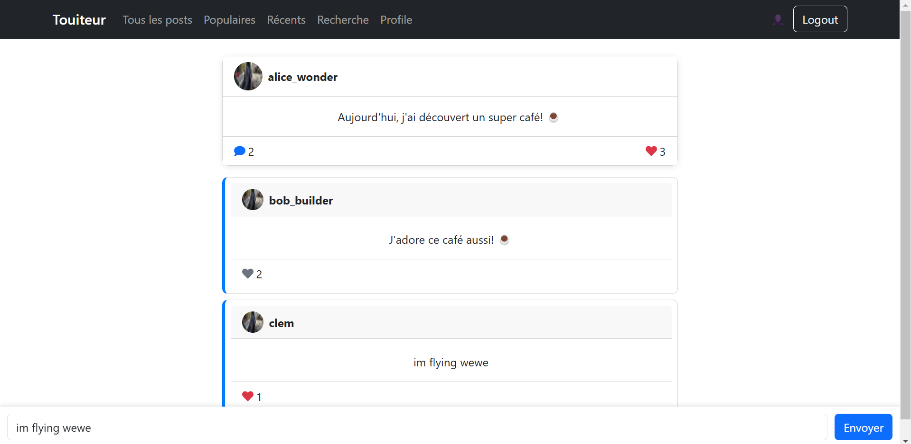

# Installation et lancement du server

npm install
npm run graphql-codegen --watch --verbose
npm run dev

## Fonctionnalités

- page register permettant de créer un user

- page login permettant de se connecter (gestion token)

*Sur la page login et register : impossible d'acceder aux autres pages*

- Page d'acceil présentant les posts, du plus récent au moins récent

- Page Populaires présentant les posts les plus populaires ( ==  ayant le plus de likes)

- Page recherchant, permettant de rechercher tous les tweets d'un utilisateur

- Page profile, permettant de poster un touite, voir tous nos posts et les supprimer.

- Page Post, permettant de voir les commentaires, liker le post ou les commentaires, et ajouter un commentaire

- 

- 

-
